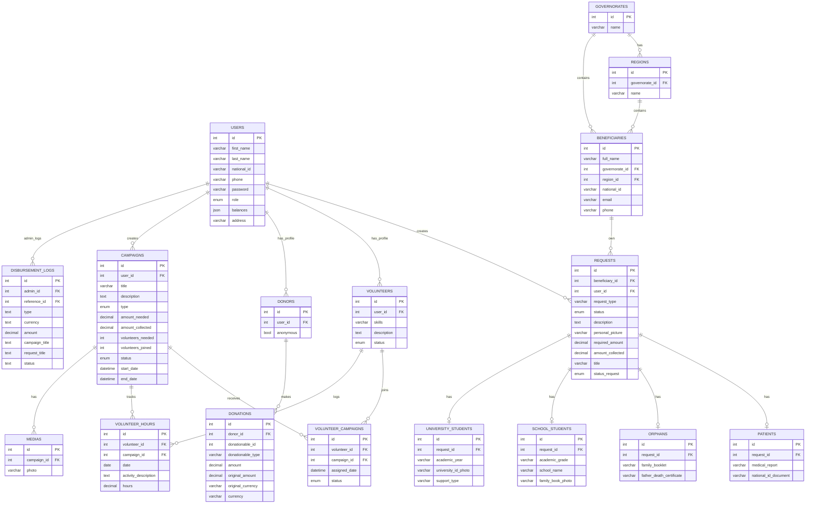

# Database ERD

This repository now includes the same database-shape reference shown in the provided image.

## Original visual reference

## Editable ERD (Mermaid)

```mermaid
erDiagram
    USERS {
        int id PK
        varchar first_name
        varchar last_name
        varchar national_id
        varchar phone
        varchar password
        enum role
        json balances
        varchar address
    }

    BENEFICIARIES {
        int id PK
        varchar full_name
        int governorate_id FK
        int region_id FK
        varchar national_id
        varchar email
        varchar phone
    }

    REQUESTS {
        int id PK
        int beneficiary_id FK
        int user_id FK
        varchar request_type
        enum status
        text description
        varchar personal_picture
        decimal required_amount
        decimal amount_collected
        varchar title
        enum status_request
    }

    PATIENTS {
        int id PK
        int request_id FK
        varchar medical_report
        varchar national_id_document
    }

    ORPHANS {
        int id PK
        int request_id FK
        varchar family_booklet
        varchar father_death_certificate
    }

    SCHOOL_STUDENTS {
        int id PK
        int request_id FK
        varchar academic_grade
        varchar school_name
        varchar family_book_photo
    }

    UNIVERSITY_STUDENTS {
        int id PK
        int request_id FK
        varchar academic_year
        varchar university_id_photo
        varchar support_type
    }

    GOVERNORATES {
        int id PK
        varchar name
    }

    REGIONS {
        int id PK
        int governorate_id FK
        varchar name
    }

    VOLUNTEERS {
        int id PK
        int user_id FK
        varchar skills
        text description
        enum status
    }

    VOLUNTEER_CAMPAIGNS {
        int id PK
        int volunteer_id FK
        int campaign_id FK
        datetime assigned_date
        enum status
    }

    VOLUNTEER_HOURS {
        int id PK
        int volunteer_id FK
        int campaign_id FK
        date date
        text activity_description
        decimal hours
    }

    CAMPAIGNS {
        int id PK
        int user_id FK
        varchar title
        text description
        enum type
        decimal amount_needed
        decimal amount_collected
        int volunteers_needed
        int volunteers_joined
        enum status
        datetime start_date
        datetime end_date
    }

    MEDIAS {
        int id PK
        int campaign_id FK
        varchar photo
    }

    DONORS {
        int id PK
        int user_id FK
        bool anonymous
    }

    DONATIONS {
        int id PK
        int donor_id FK
        int donationable_id
        varchar donationable_type
        decimal amount
        decimal original_amount
        varchar original_currency
        varchar currency
    }

    DISBURSEMENT_LOGS {
        int id PK
        int admin_id FK
        int reference_id FK
        text type
        text currency
        decimal amount
        text campaign_title
        text request_title
        text status
    }

    GOVERNORATES ||--o{ REGIONS : has
    GOVERNORATES ||--o{ BENEFICIARIES : contains
    REGIONS ||--o{ BENEFICIARIES : contains

    USERS ||--o{ REQUESTS : creates
    BENEFICIARIES ||--o{ REQUESTS : own

    REQUESTS ||--o| PATIENTS : has
    REQUESTS ||--o| ORPHANS : has
    REQUESTS ||--o| SCHOOL_STUDENTS : has
    REQUESTS ||--o| UNIVERSITY_STUDENTS : has

    USERS ||--o{ VOLUNTEERS : has_profile
    USERS ||--o{ DONORS : has_profile
    USERS ||--o{ CAMPAIGNS : creates
    USERS ||--o{ DISBURSEMENT_LOGS : admin_logs

    CAMPAIGNS ||--o{ VOLUNTEER_CAMPAIGNS : receives
    VOLUNTEERS ||--o{ VOLUNTEER_CAMPAIGNS : joins

    CAMPAIGNS ||--o{ VOLUNTEER_HOURS : tracks
    VOLUNTEERS ||--o{ VOLUNTEER_HOURS : logs

    CAMPAIGNS ||--o{ MEDIAS : has
    DONORS ||--o{ DONATIONS : makes
```
